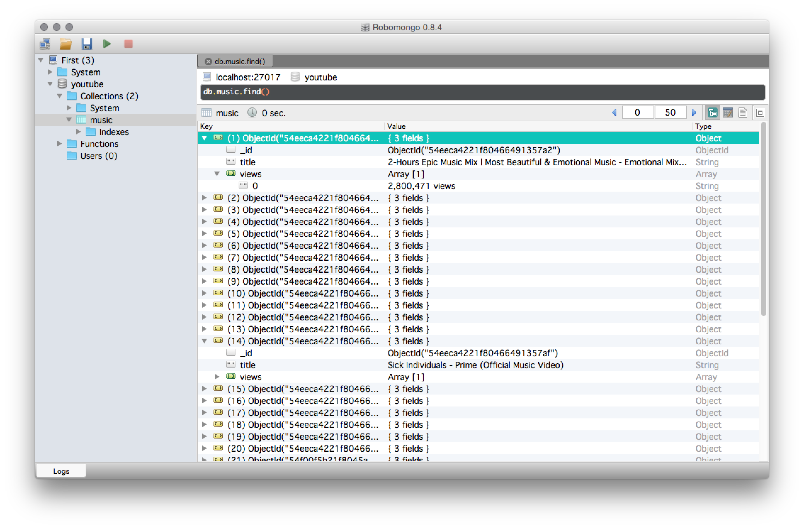

# Python & Scrapy & PyMongo

Based on [this tutorial](https://realpython.com/blog/python/web-scraping-with-scrapy-and-mongodb/).

You need to install scrapy and pymongo and mongodb.

To run this open one terminal window and type
```
$ mongod
```

It should say something like "waiting for connections on port 27017"

In another terminal window cd into realpython1 and type
```
$ scrapy crawl realpython1
```

The results should show the first 20 results for videos when searching "music" on Youtube. Also it should show 

I also used [Robomongo](http://robomongo.org) to get a better view on the data.

