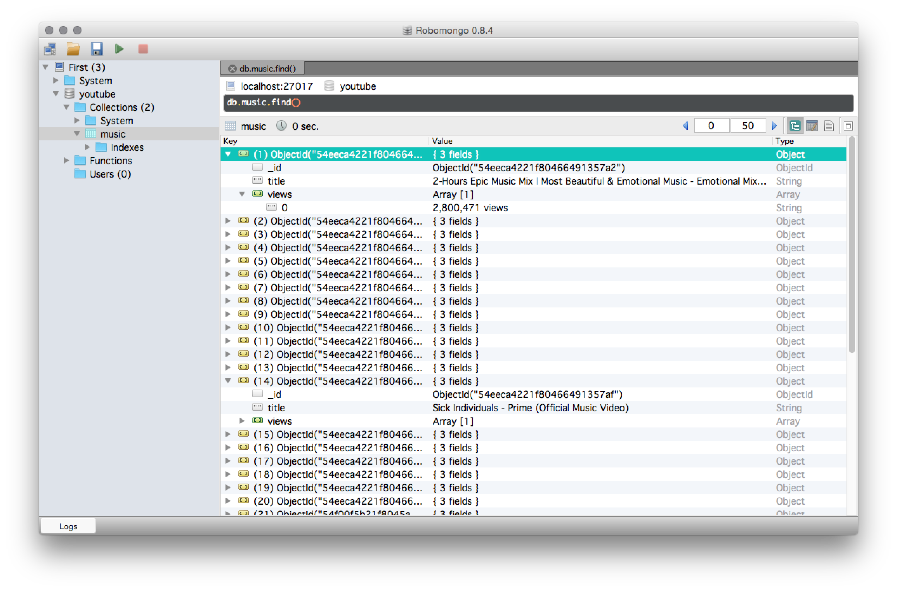

# Python & Scrapy & PyMongo

Based on [this tutorial](https://realpython.com/blog/python/web-scraping-with-scrapy-and-mongodb/).

You need to install scrapy and pymongo and mongodb.

To run my files, open one terminal window and type
```
$ mongod
```
It should say something like "waiting for connections on port 27017"

In another terminal window cd into realpython1 and type
```
$ scrapy crawl realpython1
```

The results should show the first 20 results for videos when searching "music" on Youtube. Also it should show the views count of the videos.

I also used [Robomongo](http://robomongo.org) to get a better view on the data.


###Options

Find this in realpython1_spider.py:

```
start_urls = (
  'http://www.youtube.com/results?search_query=music&filters=video',
)
```
and change 'music' to something else to get different results.
