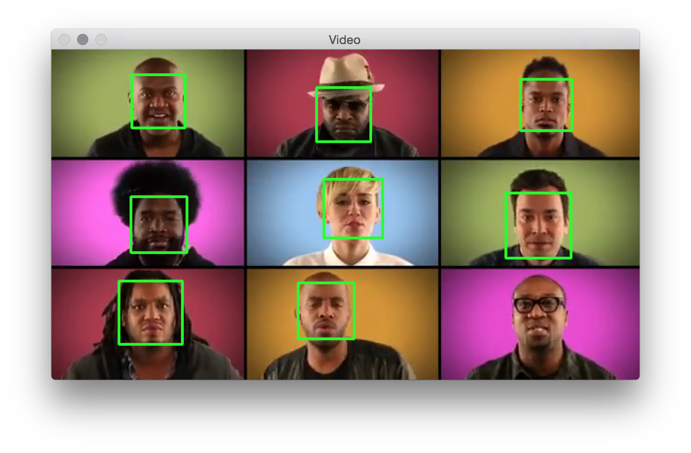

# Python & OpenCV

Based on [this tutorial](https://realpython.com/blog/python/face-detection-in-python-using-a-webcam/), which explains the code for detecting faces using your webcam input.

You need to install opencv and maybe [macports](https://www.macports.org/install.php) and to use a video file you will need [ffmpeg](https://ffmpeg.org). I just followed [this youtube tutorial](https://www.youtube.com/watch?v=1_0p9nA3yxM).

A cool thing that you can do in Terminal with ffmpeg: convert your video file, in this case I converted my video from .mov to .mp4
```
$ ffmpeg -i Stop.mov Stop.mp4
```

Here's the result with the video in this repo.

